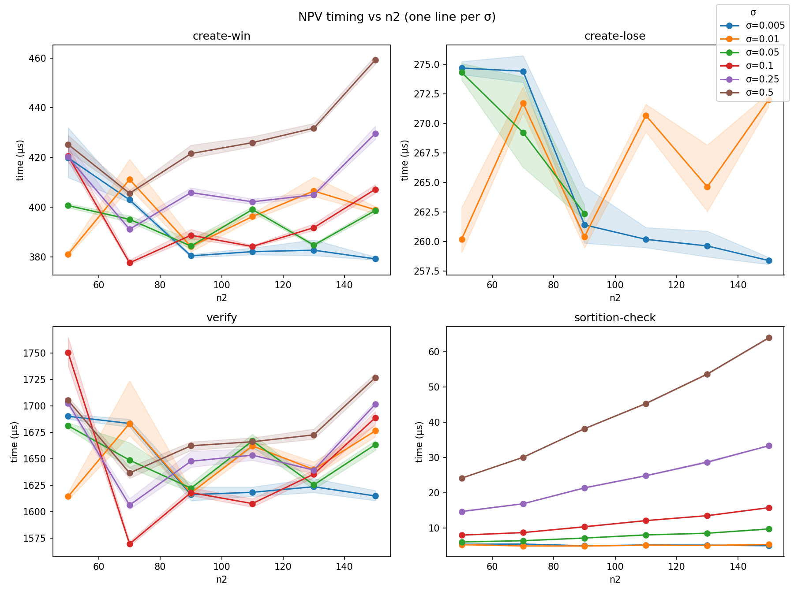
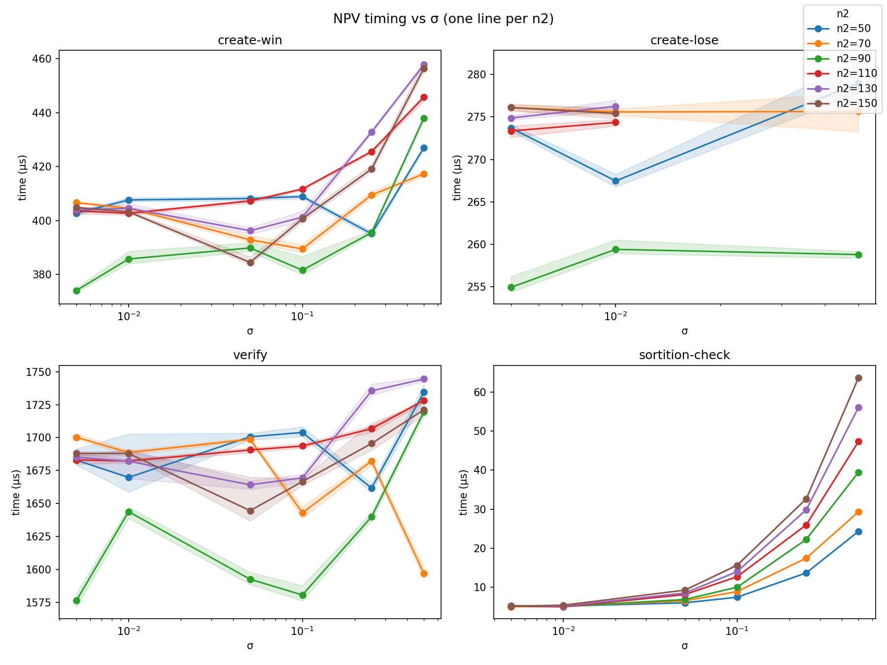
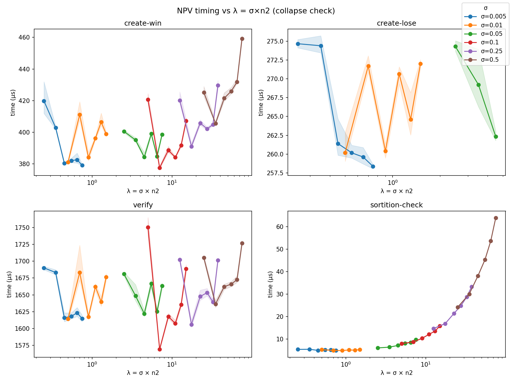
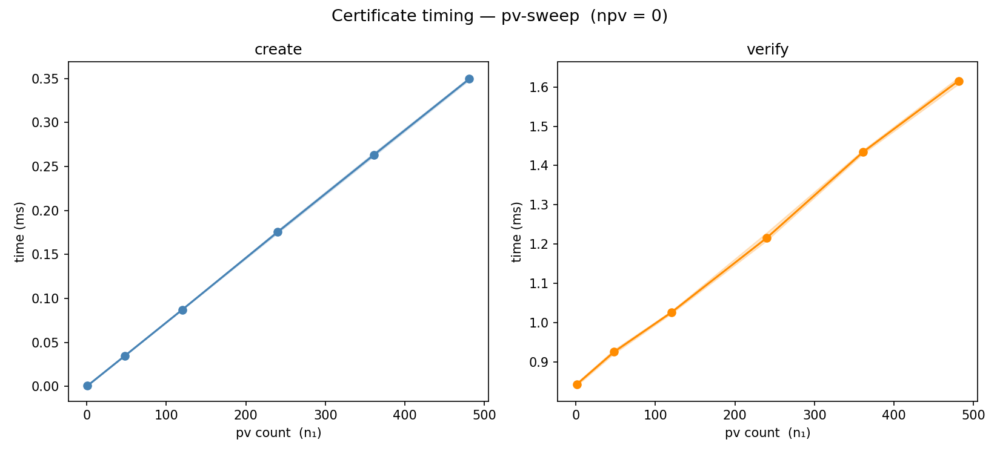
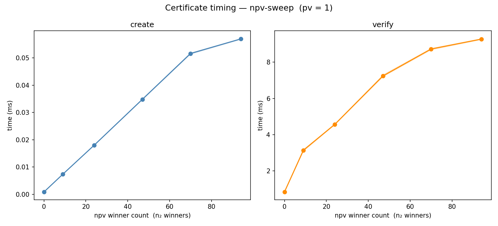
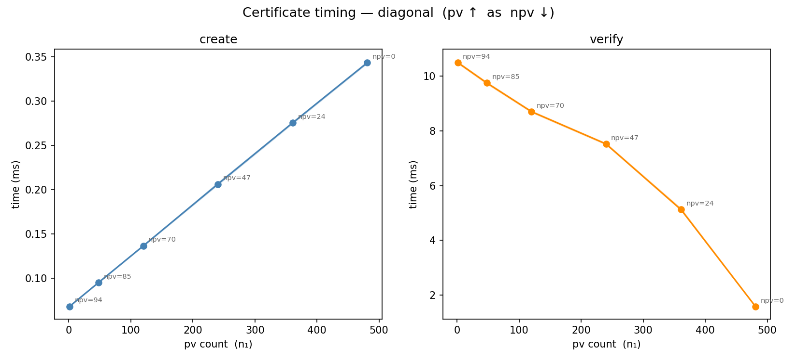
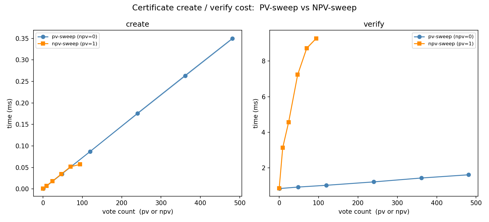

# leios-wfa-ls-demo
A demo that showcases wFA^LS, the core of Leios committee selection (see [this](https://doi.org/10.1145/3576915.3623194) paper)

## Setup
To run this demo, you need to bootstrap a node on any testnet. The steps below can help with this.
```bash
cd /tmp
mkdir preview
cd preview
wget https://book.world.dev.cardano.org/environments/preview/config.json
wget https://book.world.dev.cardano.org/environments/preview/topology.json
wget https://book.world.dev.cardano.org/environments/preview/peer-snapshot.json
wget https://book.world.dev.cardano.org/environments/preview/byron-genesis.json
wget https://book.world.dev.cardano.org/environments/preview/shelley-genesis.json
wget https://book.world.dev.cardano.org/environments/preview/alonzo-genesis.json
wget https://book.world.dev.cardano.org/environments/preview/conway-genesis.json
```
Then run
```bash
nix run github:IntersectMBO/cardano-node/10.5.3#cardano-node -- run +RTS -qg -qb -RTS \
 --topology /tmp/preview/topology.json \
 --database-path /tmp/preview/db \
 --socket-path /tmp/preview/node.socket \
 --host-addr 0.0.0.0 \
 --port 6030 \
 --config /tmp/preview/config.json
```
which lets you query, for example, via
```bash
export CARDANO_NODE_SOCKET_PATH=/tmp/preview/node.socket
nix run github:IntersectMBO/cardano-node/10.5.3#cardano-cli -- query tip --testnet-magic 2
```
## Run the demo
Given that the above sets up the preview testnet, we can run
```bash
nix run .#leios-wfa-ls-demo-exe -- --network-magic 2 --socket-path /tmp/preview/node.socket
```

---

## Benchmarks

### TL;DR

| Operation | Time |
|---|---|
| PV vote create | ~269 μs |
| PV vote verify | ~899 μs |
| NPV vote create (winner) | ~400 μs |
| NPV vote create (loser, early exit) | ~270 μs |
| NPV vote verify | ~1.65 ms |
| Cert create — PV-only (481 votes) | ~350 μs |
| Cert create — NPV-only (94 winners) | ~57 μs |
| Cert verify — PV-only (481 votes) | ~1.6 ms |
| Cert verify — NPV-only (94 winners) | ~9.3 ms |

**Bottom line:** individual vote creation and verification are fast (~400 μs and ~1.65 ms respectively). Certificate creation is now fast (<400 μs for any composition). Certificate verification scales with NPV count — a PV-only cert verifies in ~1.6 ms, while a full NPV cert (94 winners) takes ~9.3 ms due to the linearized key aggregation required.

---

### Benchmark suite

The suite is implemented with [Criterion](https://hackage.haskell.org/package/criterion) and lives in `leios-wfa-ls-demo/bench/`. There are three benchmark groups:

- **`pv`** — persistent-vote create and verify
- **`npv`** — non-persistent-vote create-win, create-lose, verify, and sortition-check; swept over `n2 ∈ {50,70,90,110,130,150}` and `σ ∈ {0.005, 0.01, 0.05, 0.1, 0.25, 0.5}`
- **`cert`** — certificate create and verify against a live mainnet stake distribution, across three sweep patterns (pv-sweep, npv-sweep, diagonal)

The cert benchmarks require a running Cardano node (mainnet or testnet) to query the stake distribution.

---

### Reproducing the results

#### Vote benchmarks

```bash
rm -f bench-report-votes.csv bench-report-votes.html
nix run .#leios-wfa-ls-demo-bench -- \
  --csv bench-report-votes.csv \
  --output bench-report-votes.html \
  --match pattern pv \
  --match pattern npv
```

Then plot:

```bash
python analysis/plot_vote_bench.py bench-report-votes.csv --outdir analysis/
```

Outputs:

| File | What it shows |
|---|---|
| `analysis/npv_vs_n2.png` | NPV timing vs committee size n2, one line per σ |
| `analysis/npv_vs_sigma.png` | NPV timing vs σ (log scale), one line per n2 |
| `analysis/npv_vs_lambda.png` | NPV timing vs λ = σ×n2 — collapse check for sortition-check cost |





#### Certificate benchmarks

Requires a running Cardano node socket (mainnet or any testnet with real stake). For mainnet:

```bash
export LEIOS_BENCH_NODE_SOCKET=~/cardano/mainnet/node.socket
# LEIOS_BENCH_NETWORK_MAGIC defaults to 764824073 (mainnet) if unset

nix run .#leios-wfa-ls-demo-bench -- \
  --csv bench-report-cert.csv \
  --output bench-report-cert.html \
  --match pattern cert
```

Then plot:

```bash
python analysis/plot_cert_bench.py bench-report-cert.csv --outdir analysis/
```

Outputs:

| File | What it shows |
|---|---|
| `analysis/cert_pv_sweep.png` | Cert timing vs PV count (NPV fixed at 0) |
| `analysis/cert_npv_sweep.png` | Cert timing vs NPV winner count (PV fixed at 1) |
| `analysis/cert_diagonal.png` | Cert timing as PV increases while NPV decreases |
| `analysis/cert_cost_comparison.png` | PV-sweep vs NPV-sweep side by side |






#### Running all benchmarks at once

```bash
rm -f bench-report.csv bench-report.html
nix run .#leios-wfa-ls-demo-bench -- --csv bench-report.csv --output bench-report.html
```

---

### Analysis

> Results collected on a 12th Gen Intel® Core™ i9-12900H × 20 / 64 GiB machine.

#### Votes

**PV (persistent vote)**

PV creation involves a single BLS-12-381 signature over the election ID and endorser block hash. PV verification is a single BLS pairing check. Both are constant-time with respect to committee parameters — the BLS operations dominate at roughly 269 μs (create) and 	899 μs (verify).

**NPV (non-persistent vote)**

NPV creation requires a VRF evaluation to determine eligibility (sortition), followed by a BLS signature only if the node wins. The benchmarks separate four cases:

- **create-win** (~375–460 μs): VRF eval + BLS sign. Time is essentially flat across n2 values. It rises slightly with σ because higher σ means more Taylor expansion terms in the sortition check, but the BLS sign dominates.
- **create-lose** (~255–280 μs): VRF eval only, no signing. Only benchmarked for low λ = σ×n2 regimes where losing is probable. ~35% faster than create-win, confirming that BLS signing accounts for most of the create-win cost.
- **verify** (~1.575–1.75 ms): One BLS pairing check, comparable to PV verify. Essentially independent of n2 and σ.
- **sortition-check** (~6–65 μs): The isolated Taylor expansion used to compare the VRF output against the eligibility threshold. Negligible at low λ (<10 μs for σ ≤ 0.01), but grows to ~65 μs at (σ=0.5, n2=150) where the series needs more terms to converge.

The λ-collapse plot confirms that `sortition-check` cost collapses onto a single curve when plotted against λ = σ×n2, showing that λ is the sole predictor of Taylor expansion cost. `create-win` and `verify` do not collapse — they are dominated by BLS, not by λ.


#### Certificates

Cert benchmarks use the live mainnet stake distribution with a target committee size of 575. The run used for the charts yielded approximately 481 PV seats and 94 NPV winners (out of ~700 NPV voters).

**Creation**

Creation uses plain BLS signature aggregation (scalar 1 per voter), making it very fast:

- **PV-sweep** (npv=0, pv up to 481): Scales linearly from ~0.85 μs (1 vote) to ~350 μs (481 votes), about 0.73 μs per PV vote.
- **NPV-sweep** (pv=1, npv up to 94): Scales linearly from ~7.4 μs (9 winners) to ~57 μs (94 winners), about 0.6 μs per NPV vote. NPV and PV aggregation are similarly cheap.
- **Diagonal** (pv↑ as npv↓): Confirms that creation cost is determined by total vote count rather than vote type. Times range from ~68 μs (pv=1, npv=94) to ~344 μs (pv=481, npv=0).


**Verification**

Verification cost is dominated by NPV count due to linearized multi-scalar multiplication (MSM) over NPV public keys, which is required to defend against VRF-output-swap attacks:

- **PV-sweep**: ~0.84–1.6 ms across the full range of PV counts. Grows gently with vote count (one extra pairing per vote).
- **NPV-sweep**: ~0.85–9.3 ms across 0–94 NPV winners. Scales roughly linearly with NPV count (~100 μs per winner at this committee size).
- **Diagonal**: Ranges from ~10.5 ms (pv=1, npv=94) down to ~1.6 ms (pv=481, npv=0), tracking NPV count almost exactly.

**Key takeaway:** cert creation is fast for any composition (<400 μs). Cert verification is the bottleneck when NPV winners are numerous — a full NPV cert (94 winners) takes ~9–10 ms to verify due to the linearized MSM. A design that favours PV over NPV significantly reduces verification time.

**Certificate size**

Serialised certificate size depends only on the number of NPV winners, not on the PV count:

| Sweep | pv | npv winners | size (bytes) |
|---|---|---|---|
| pv-sweep | 1–481 | 0 | 162 |
| npv-sweep | 1 | 0 | 162 |
| npv-sweep | 1 | 9 | 882 |
| npv-sweep | 1 | 24 | 2 082 |
| npv-sweep | 1 | 47 | 3 922 |
| npv-sweep | 1 | 70 | 5 762 |
| npv-sweep | 1 | 94 | 7 682 |
| diagonal | 1 | 94 | 7 682 |
| diagonal | 48 | 85 | 6 962 |
| diagonal | 120 | 70 | 5 762 |
| diagonal | 240 | 47 | 3 922 |
| diagonal | 361 | 24 | 2 082 |
| diagonal | 481 | 0 | 162 |
